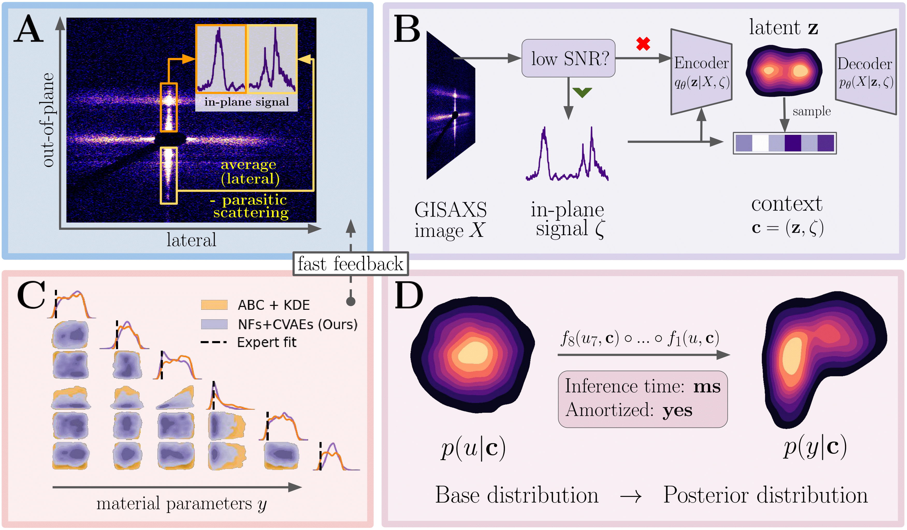

# Amortized Bayesian Inference of GISAXS Data with Normalizing Flows

Maksim Zhdanov, Lisa Randolph, Thomas Kluge, Motoaki Nakatsutsumi, Christian Gutt, Marina Ganeva, and Nico Hoffmann

<a href="https://arxiv.org/abs/2210.01543">Link to the paper</a>

Machine Learning and the Physical Sciences Workshop at NeurIPS 2022

If you find our work and/or our code useful, please cite us via:

```bibtex
@article{Zhdanov2022AmortizedBI,
  title={Amortized Bayesian Inference of GISAXS Data with Normalizing Flows},
  author={Maksim Zhdanov and Lisa Randolph and Thomas Kluge and Motoaki Nakatsutsumi and Christian Gutt and Marina Ganeva and Nico Hoffmann},
  journal={ArXiv},
  year={2022},
  volume={abs/2210.01543}
}
```



###  Train NF-VAE model:
`python scripts/train_pipe.py`
OR
see `Training.ipynb`

### Inference
see `Inference.ipynb`
